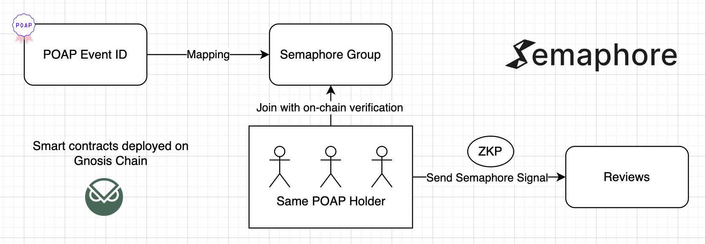

# Verified Anonymous

Verified reviews, preserved privacy.

## Submission

### Live App

https://verified-anonymous.vercel.app/

### Demo Video

TBD

### Pitch Deck

https://docs.google.com/presentation/d/1qPRk-fP52QXpEG-6EvGmDNyGn5eiyEdVi29xm45Z-30/edit?usp=sharing

## Description

Verified Anonymous provides verification with POAP and protects user privacy with Semaphore.

### Benefit

This innovative approach offers the following key benefits:

#### Reviewers

- Can give honest feedback while remaining anonymous
- Verification ensures authenticity of reviews

#### Viewers

- Read honest reviews from verified users, providing greater trust and confidence in the feedback

### How it works

- Event organizers can now register their events using a POAP
- Users can authenticate their attendance with POAP and submit privacy-protected reviews using the Semaphore
- Only targeted POAP users can join the group
- The signal is visible to everyone, but the actual sender remains hidden with Semaphore

## Refecence

### Tested POAP

https://app.poap.xyz/token/6361720
